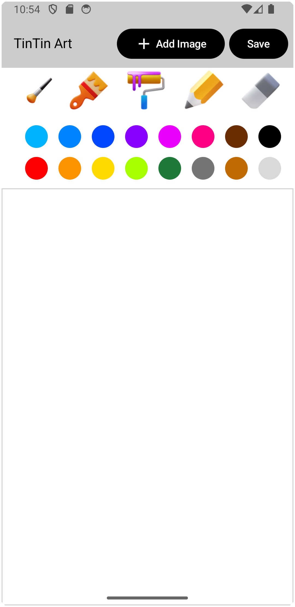
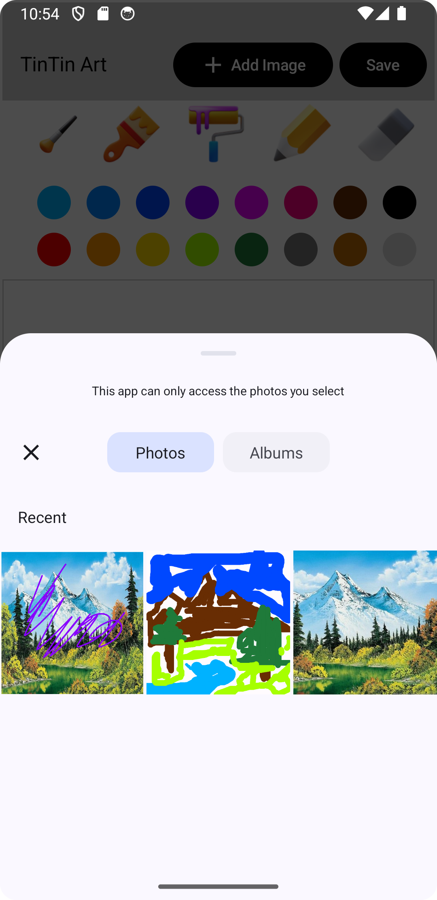
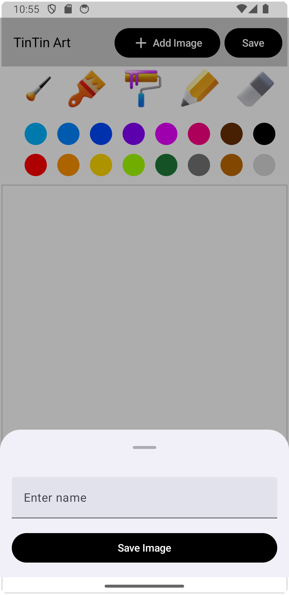

# My Android App

## Overview

Welcome to the repository for **My Android App**, an Android application built using Kotlin and Jetpack Compose. This app demonstrates modern Android development practices, featuring a clean and intuitive user interface, responsive design, and seamless navigation.

## Features

- **Modern UI**: Utilizing Jetpack Compose for a responsive and declarative UI.
- **Interactive Elements**: Customizable components and interactive features.
- **Navigation**: Easy-to-use navigation with smooth transitions.
- **Data Management**: Efficient data handling with state management.

## Screenshots

### Home Screen


### Local File


### Save


## Getting Started

To get started with this project, clone the repository and import it into Android Studio. Follow the instructions below:

### Prerequisites

- Android Studio (Arctic Fox or later)
- JDK 11 or higher

### Installation

1. Clone the repository:
   ```bash
   git clone https://github.com/yourusername/your-repo-name.git
